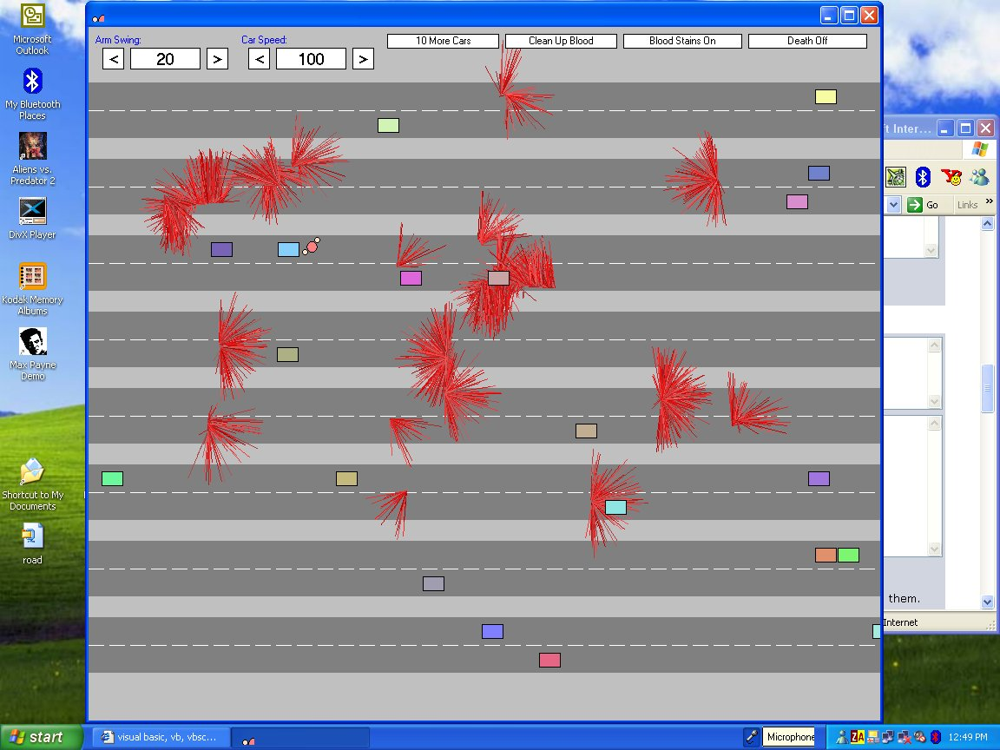

## \[\[\[A Road Crossing Game\. \(Includes Blood Splatter\)\]\]\] \(now with InverseTan\.bas\(sorry\)\)

### Description

Little dude runs across a 16 lane highway. his arms swing from side to side, try not to get hgit by the cars. you can change the armswing amplitude, the car speed, turn death on or off, blood stains on or off, etc. have fun
 
### More Info
 
ummmm...

i wrote ALL the functions in this MYSELF (yay!)

except for the InverseTan module, which i stole and modified.

feel free to steal any of my functions, but dont say you wrote them

if you liek this, i have loads of other programs that i never bothered to submit

so tell me if you'rew interested.

bye

you might get jealous of me

cos i wrote it

and you might not be able to write it

but you might

and then you will feel better

cos you are better than me

congratulations

now i am jealous

             |
---                |---
**Submitted On**   |2004-05-01 11:53:48
**By**             |[Scott Buckley](https://github.com/Planet-Source-Code/PSCIndex/blob/master/ByAuthor/scott-buckley.md)
**Level**          |Advanced
**User Rating**    |4.5 (27 globes from 6 users)
**Compatibility**  |VB 6\.0
**Category**       |[Games](https://github.com/Planet-Source-Code/PSCIndex/blob/master/ByCategory/games__1-38.md)
**World**          |[Visual Basic](https://github.com/Planet-Source-Code/PSCIndex/blob/master/ByWorld/visual-basic.md)
**Archive File**   |[\[\[\[A\_Road\_174024532004\.zip](https://github.com/Planet-Source-Code/scott-buckley-a-road-crossing-game-includes-blood-splatter-now-with-inversetan-bas-sorry__1-53521/archive/master.zip)

### API Declarations

IntersectRect

